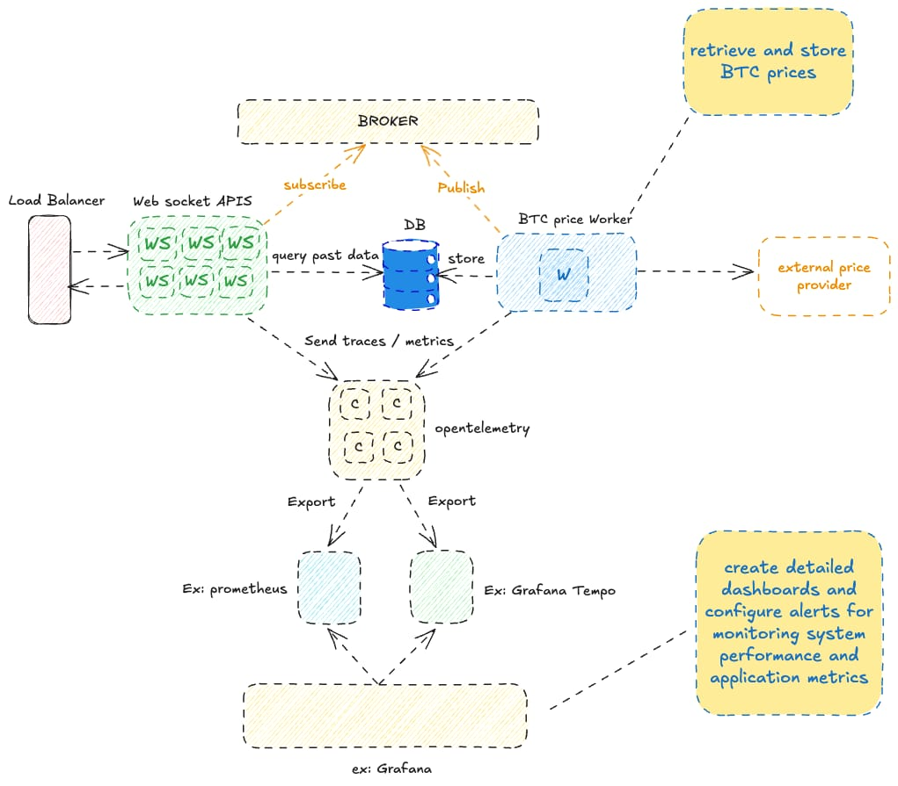

# Awesome Crypto Price

## Overview
This project fetches the current Bitcoin price using external APIs and provides a WebSocket interface for real-time updates.

## Prerequisites
- Docker
- Go (if running locally)

## Commands

### Build the Docker Image
bash
make docker-build

### Run the Docker Container
bash
make docker-run

### Run Tests
bash
make test

## Production proposal
